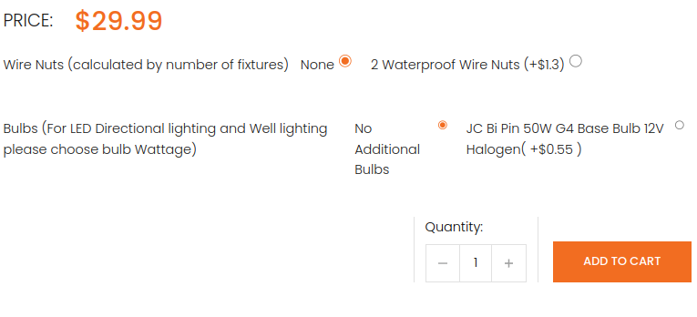
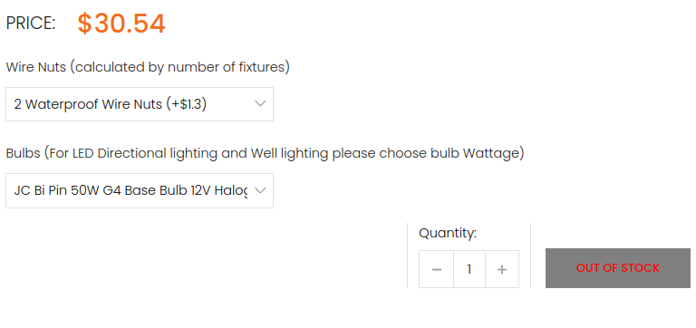

# Lexmodo Variant Builder
This README file explains how to build product variants automatically as select/radio depending on your design 

---
## Structure (inside product/index.plush.html)
```html
<%= form({action: cartPath(), method: "POST", class:""}) { %>
    <!-- 
    ***M A I N        F O R M        T H A T        W R A P S        T H E        O U R        V A R I A N T S***
    ↓↓↓↓ This is the div that wraps your prices (normal/discounted prices) | !NOTE: don't forget your selector (UNIQUE)
    -->
    <div class="prices-div"></div>
    <!-- 
    ↓↓↓↓ This is the div that wraps the variants options as (select or input:radio) elements | !NOTE: don't forget your selector (UNIQUE)
    -->
    <div class="variants-select-wrapper"></div>
    <!-- 
    ↓↓↓↓ This is the add to cart button !NOTE: don't forget your selector (UNIQUE) | !NOTE: give the disabled button unique style
    -->
    <button class="" type="submit">ADD TO CART</button>
<% } %>
```

---

## Inside JS
Import the 'buildVariantOptions' function from 'variants-builder.js' and use it to create the variantBuilder function.
```javascript
import buildVariantOptions from "./variants-builder.js";
buildVariantOptions(
    {
    cartFormSelector: 'form[action="/cart/"]', // Pass in your cart selector | !NOTE: ("string" value)
    productPriceWrapperSelector: ".price-row", // Pass in your price div selector that will wrap your prices | !NOTE: ("string" value)
    addToCartBtnSelector: ".add-product-to-cart", // Pass in your "add to cart" button selector | !NOTE: ("string" value)
    selectOptionsWrapperSelector: ".variants-select-wrapper", // Pass in your cart selector | !NOTE: ("string" value)
    },
    inputType, // Set inputType to 'select' or 'radio' as needed | !NOTE: ("string" value)
    callbacks // Pass the array of callback functions | !NOTE: [reference to the array, reference to the array, ...] or you can omit it
);
```

## Results


Note: The comments in the code provide guidance on where to place the previous button, index tabs, next button, and other relevant elements.
